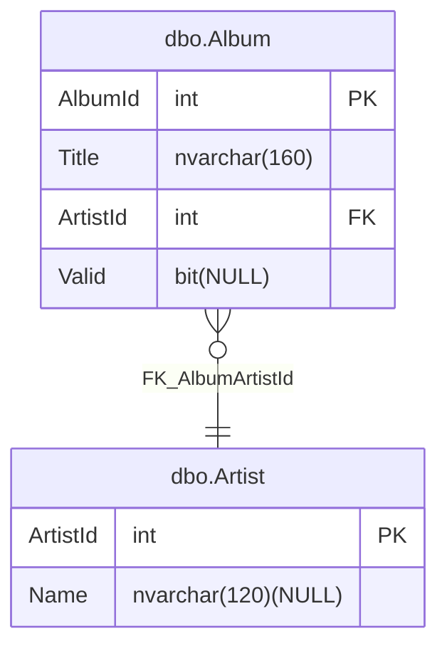

# Entity Relationship diagram

## Enable diagram generation

The SDK supports generating an Entity Relationship diagram from your project. To enable this, add the `GenerateEntityRelationshipDiagram` property to your project file:

```xml
<Project Sdk="MSBuild.Sdk.SqlProj/4.1.1">
  <PropertyGroup>
    <GenerateEntityRelationshipDiagram>True</GenerateEntityRelationshipDiagram>
  </PropertyGroup>
</Project>
```

## Generated output

The generated diagram is saved in the project directory. The diagram is generated as a `.md` file and is named after the database project, for example `TestProject_erdiagram.md`.

## Example diagram

This is a sample of the generated diagram:


