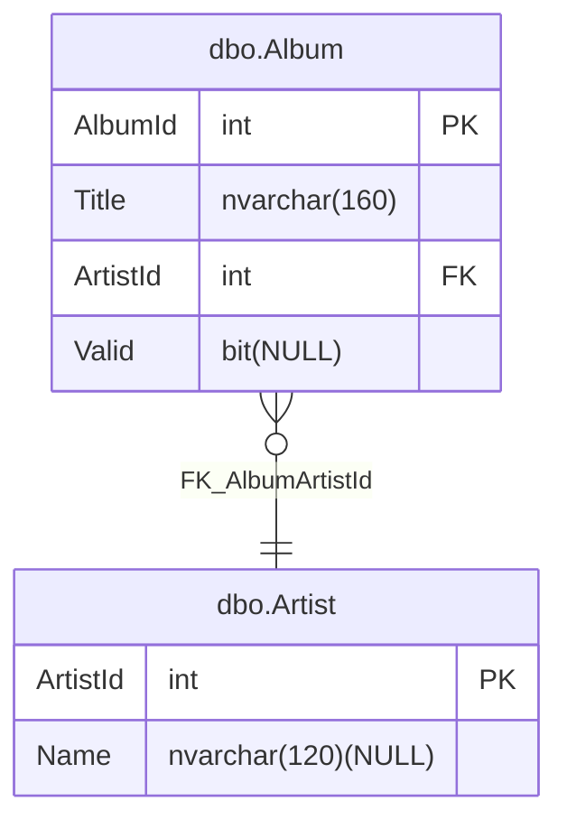

# Entity Relationship diagram

## Enable diagram generation

The SDK supports generating an Entity Relationship diagram from your project. To enable this, add the `GenerateEntityRelationshipDiagram` property to your project file:

```xml
<Project Sdk="MSBuild.Sdk.SqlProj/4.2.0">
  <PropertyGroup>
    <GenerateEntityRelationshipDiagram>True</GenerateEntityRelationshipDiagram>
  </PropertyGroup>
</Project>
```

## Generated output

### Single Diagram

The generated diagram is saved in the project directory. The diagram is generated as a `.md` file and is named after the database project, for example `TestProject_erdiagram.md`.


### Multiple Diagrams

If you only want a subset of tables in the diagram, add an `EntityRelationshipDiagramConfigFile` property that points to a JSON file:

```xml
<Project Sdk="MSBuild.Sdk.SqlProj/4.2.0">
  <PropertyGroup>
    <GenerateEntityRelationshipDiagram>True</GenerateEntityRelationshipDiagram>
    <EntityRelationshipDiagramConfigFile>erdiagram.json</EntityRelationshipDiagramConfigFile>
  </PropertyGroup>
</Project>
```

Example `erdiagram.json`:

```json
{
  "$schema": "https://raw.githubusercontent.com/rr-wfm/MSBuild.Sdk.SqlProj/master/src/MSBuild.Sdk.SqlProj/Sdk/EntityRelationshipDiagramConfig.schema.json",
  "tables": [
    "dbo.Customer",
    "OrderHeader"
  ]
}
```

Table names can be schema-qualified, such as `dbo.Customer`, or unqualified, such as `OrderHeader`. When a config file is provided, only matching tables are rendered in the diagram.

To generate multiple diagrams, define multiple config files in an item group:

```xml
<Project Sdk="MSBuild.Sdk.SqlProj/4.2.0">
  <PropertyGroup>
    <GenerateEntityRelationshipDiagram>True</GenerateEntityRelationshipDiagram>
  </PropertyGroup>

  <ItemGroup>
    <EntityRelationshipDiagramConfigFile Include="Configs\sales_erdiagram.json" />
    <EntityRelationshipDiagramConfigFile Include="Configs\hr_erdiagram.json" />
  </ItemGroup>
</Project>
```

Each config file can optionally contain `schemas`, `tables`, and `outputFileName`:

```json
{
  "schemas": [ "sales", "hr" ],
  "tables": [ "dbo.Customer", "reporting.Snapshot" ],
  "outputFileName": "operations_erdiagram.md"
}
```

The filter behavior is:

- `schemas` includes all tables in the listed schemas.
- `tables` includes specific named tables, even if they are outside the listed schemas.
- If both `schemas` and `tables` are specified, the included set is the union of both filters.
- `outputFileName` is optional.
- If `outputFileName` is omitted and there is one config file, the output name defaults to `<DatabaseName>_erdiagram.md`.
- If `outputFileName` is omitted and there are multiple config files, the output name defaults to `<DatabaseName>_<ConfigFileName>_erdiagram.md`, so each config file gets a distinct default output name.

When a selected table has a foreign key to a filtered-out table, the diagram still shows the relationship and renders the referenced table as an empty placeholder so cross-schema dependencies remain visible.

## Example diagram

This is a sample of the generated diagram:


