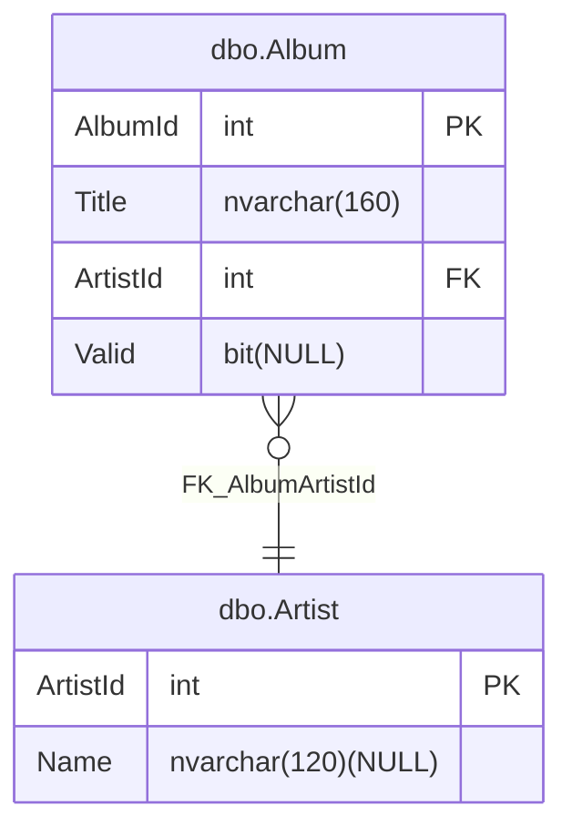

# Project File Guide

## Model properties

There are a lot of properties that can be set on the model in the resulting `.dacpac` file which can be influenced by setting those properties in the project file using the same name. For example, the snippet below sets the `RecoveryMode` property to `Simple`:

```xml
<Project Sdk="MSBuild.Sdk.SqlProj/4.2.0">
    <PropertyGroup>
        <TargetFramework>net10.0</TargetFramework>
        <RecoveryMode>Simple</RecoveryMode>
        <SqlServerVersion>SqlAzure</SqlServerVersion>
    </PropertyGroup>
</Project>
```

Refer to the [documentation](https://docs.microsoft.com/dotnet/api/microsoft.sqlserver.dac.model.tsqlmodeloptions) for more details on the available properties. The [SqlServerVersion](https://docs.microsoft.com/dotnet/api/microsoft.sqlserver.dac.model.sqlserverversion) property is also  supported.

**Note:** If you are replacing an existing `.sqlproj` be sure to copy over any of these properties into the new project file.

## Model compiler options

Like `.sqlproj` projects  `MSBuild.Sdk.SqlProj` supports controlling T-SQL build errors and warnings by using MSBuild properties.
Treating warnings as errors can be optionally enabled by adding a property `TreatTSqlWarningsAsErrors` to the project file:

```xml
<Project Sdk="MSBuild.Sdk.SqlProj/4.2.0">
    <PropertyGroup>
        <TreatTSqlWarningsAsErrors>True</TreatTSqlWarningsAsErrors>
        ...
    </PropertyGroup>
</Project>
```

> Note: Alternatively, you can use `TreatWarningsAsErrors` instead of `TreatTSqlWarningsAsErrors` to apply the same effect.

To suppress specific warnings from being treated as errors, add a comma-separated list of warning codes to `SuppressTSqlWarnings` property in the project file:

```xml
<Project Sdk="MSBuild.Sdk.SqlProj/4.2.0">
    <PropertyGroup>
        <SuppressTSqlWarnings>71558,71502</SuppressTSqlWarnings>
        <TreatTSqlWarningsAsErrors>True</TreatTSqlWarningsAsErrors>
        ...
    </PropertyGroup>
</Project>
```

You can suppress warnings for a specific file by adding `SuppressTSqlWarnings` for this file:

```xml
<Project Sdk="MSBuild.Sdk.SqlProj/4.2.0">
    <PropertyGroup>
        ...
    </PropertyGroup>

    <ItemGroup>
        <Content Include="Procedures\csp_Test.sql">
            <SuppressTSqlWarnings>71502</SuppressTSqlWarnings>
        </Content>
    </ItemGroup>
</Project>
```

> Note: Warnings suppressed at the project level are always applied to every file in the project, regardless of what is configured at the file level.

## Pre- and post deployment scripts

[These scripts](https://learn.microsoft.com/sql/tools/sql-database-projects/concepts/pre-post-deployment-scripts) will be automatically executed when deploying the `.dacpac` to SQL Server.

To include these scripts into your `.dacpac` add the following to your `.csproj`:

```xml
<Project Sdk="MSBuild.Sdk.SqlProj/4.2.0">
    <PropertyGroup>
        ...
    </PropertyGroup>

  <ItemGroup>
    <PostDeploy Include="Post-Deployment\Script.PostDeployment.sql" />
    <PreDeploy Include="Pre-Deployment\Script.PreDeployment.sql" />
  </ItemGroup>
</Project>
```

It is important to note that scripts in the `Pre-Deployment` and `Post-Deployment` folders are excluded from the build process by default. This is because these scripts typically don't define database objects, such as tables and stored procedure, but perform other tasks that cannot be represented in the model. If these aren't excluded your build might break with a SQL46010 error. Instead, you should create a script file that includes all of those scripts using the `:r <path-to-script>.sql` syntax and then reference that script in your project file (as shown above).

By default the pre- and/or post-deployment script of referenced packages (both [Package references](references.md#package-references) and [Project references](references.md#project-references)) are not run when using `dotnet publish`. This can be optionally enabled by adding a property `RunScriptsFromReferences` to the project file as in the below example:

```xml
<Project Sdk="MSBuild.Sdk.SqlProj/4.2.0">
    <PropertyGroup>
        <RunScriptsFromReferences>True</RunScriptsFromReferences>
        ...
    </PropertyGroup>

    <ItemGroup>
      <PackageReference Include="MyDatabasePackage" Version="1.0.0" />
    </ItemGroup>
</Project>
```

## SQLCMD variables

Especially when using pre- and post-deployment scripts, but also in other scenario's, it might be useful to define variables that can be controlled at deployment time. This is supported using SQLCMD variables. These variables can be defined in your project file using the following syntax:

```xml
<Project Sdk="MSBuild.Sdk.SqlProj/4.2.0">
    <PropertyGroup>
        ...
    </PropertyGroup>

  <ItemGroup>
    <SqlCmdVariable Include="MySqlCmdVariable">
      <DefaultValue>DefaultValue</DefaultValue>
      <Value>$(SqlCmdVar__1)</Value>
    </SqlCmdVariable>
    <SqlCmdVariable Include="MySqlCmdVariable2">
      <DefaultValue>DefaultValue</DefaultValue>
      <Value>$(SqlCmdVar__2)</Value>
    </SqlCmdVariable>
  </ItemGroup>
</Project>
```

> Note: With version 3.0.0 of the SDK, the `DefaultValue` is not applied to the build output, in line with the standard `.sqlproj` behaviour.

## Script generation

Instead of using `dotnet publish /t:PublishDatabase` to deploy changes to a database, you can also have a full SQL script generated that will create the database from scratch and then run that script against a SQL Server. This can be achieved by adding the following to the project file:

```xml
<Project Sdk="MSBuild.Sdk.SqlProj/4.2.0">
  <PropertyGroup>
      <GenerateCreateScript>True</GenerateCreateScript>
      <IncludeCompositeObjects>True</IncludeCompositeObjects>
  </PropertyGroup>
</Project>
```

With this enabled you'll find a SQL script with the name `<database-name>_Create.sql` in the bin folder. When the project is referenced by another project, the generated script is also copied to the referencing project's output directory alongside the `.dacpac`.
The database name for the create script gets resolved in the following manner:

1. `TargetDatabaseName`.
1. Package name.

> Note:

- the generated script also uses the resolved database name via a setvar command.
- if `IncludeCompositeObjects` is true, the composite objects (tables, etc.) from external references are also included in the generated script. This property defaults to `true`

## Entity Relationship diagram

The SDK supports generating an Entity Relationship (ER) diagram from your project. To enable this, add the `GenerateEntityRelationshipDiagram` property to your project file:

```xml
<Project Sdk="MSBuild.Sdk.SqlProj/4.2.0">
  <PropertyGroup>
    <GenerateEntityRelationshipDiagram>True</GenerateEntityRelationshipDiagram>
  </PropertyGroup>
</Project>
```

The generated diagram is saved in the project directory. The diagram is generated as a `.md` file and is named after the database project, for example `TestProject_erdiagram.md`.

If you only want a subset of tables in the diagram, add an `EntityRelationshipDiagramConfigFile` property that points to a JSON file:

```xml
<Project Sdk="MSBuild.Sdk.SqlProj/4.1.2">
  <PropertyGroup>
    <GenerateEntityRelationshipDiagram>True</GenerateEntityRelationshipDiagram>
    <EntityRelationshipDiagramConfigFile>erdiagram.json</EntityRelationshipDiagramConfigFile>
  </PropertyGroup>
</Project>
```

Example `erdiagram.json`:

```json
{
  "$schema": "https://raw.githubusercontent.com/rr-wfm/MSBuild.Sdk.SqlProj/master/src/MSBuild.Sdk.SqlProj/Sdk/EntityRelationshipDiagramConfig.schema.json",
  "tables": [
    "dbo.Customer",
    "OrderHeader"
  ]
}
```

Table names can be schema-qualified, such as `dbo.Customer`, or unqualified, such as `OrderHeader`. When a config file is provided, only matching tables are rendered in the diagram.

To generate multiple diagrams, define multiple config files in an item group:

```xml
<Project Sdk="MSBuild.Sdk.SqlProj/4.1.2">
  <PropertyGroup>
    <GenerateEntityRelationshipDiagram>True</GenerateEntityRelationshipDiagram>
  </PropertyGroup>

  <ItemGroup>
    <EntityRelationshipDiagramConfigFile Include="Configs\sales.erdiagram.json" />
    <EntityRelationshipDiagramConfigFile Include="Configs\hr.erdiagram.json" />
  </ItemGroup>
</Project>
```

Each config file can optionally contain `schemas`, `tables`, and `outputFileName`:

```json
{
  "schemas": [ "sales", "hr" ],
  "tables": [ "dbo.Customer", "reporting.Snapshot" ],
  "outputFileName": "operations.erdiagram.md"
}
```

The filter behavior is:

- `schemas` includes all tables in the listed schemas.
- `tables` includes specific named tables, even if they are outside the listed schemas.
- If both `schemas` and `tables` are specified, the included set is the union of both filters.
- `outputFileName` is optional.
- If `outputFileName` is omitted and there is one config file, the output name defaults to `<DatabaseName>_erdiagram.md`.
- If `outputFileName` is omitted and there are multiple config files, the output name defaults to `<DatabaseName>_<ConfigFileName>_erdiagram.md`, so each config file gets a distinct default output name.

When a selected table has a foreign key to a filtered-out table, the diagram still shows the relationship and renders the referenced table as an empty placeholder so cross-schema dependencies remain visible.

This is a sample of the generated diagram:



## Static code analysis

Starting with version 2.7.0 of the SDK, there is support for running static code analysis during build. The SDK includes the following sets of rules:

- Microsoft.Rules ([1](https://learn.microsoft.com/en-us/previous-versions/visualstudio/visual-studio-2010/dd193411(v=vs.100)), [2](https://learn.microsoft.com/en-us/previous-versions/visualstudio/visual-studio-2010/dd193246(v=vs.100)) and [3](https://learn.microsoft.com/en-us/previous-versions/visualstudio/visual-studio-2010/dd172117(v=vs.100)))

Static code analysis can be enabled by adding the `RunSqlCodeAnalysis` property to the project file:

```xml
<Project Sdk="MSBuild.Sdk.SqlProj/4.2.0">
  <PropertyGroup>
    <TargetFramework>net10.0</TargetFramework>
    <RunSqlCodeAnalysis>True</RunSqlCodeAnalysis>
    <CodeAnalysisRules>-SqlServer.Rules.SRD0006;-Smells.*</CodeAnalysisRules>
  </PropertyGroup>
</Project>
```

> Notice that the target framework must be set to `net8.0` or `net10.0` when using additional NuGet-based rules.

A xml file with the analysis results is created in the output folder.

The optional `CodeAnalysisRules` property allows you to disable individual rules or groups of rules for the entire project.

Starting with version 3.0.0 of the SDK, you can also disable rules per file. Add a `StaticCodeAnalysis.SuppressMessages.xml` file to the project root, with contents similar to this:

```xml
<?xml version="1.0" encoding="utf-8" ?>
<StaticCodeAnalysis version="2" xmlns="urn:Microsoft.Data.Tools.Schema.StaticCodeAnalysis">
   <SuppressedFile FilePath="Procedures\sp_Test.sql">
   <SuppressedRule Category="Microsoft.Rules.Data" RuleId="SR0001" />
   </SuppressedFile>
</StaticCodeAnalysis>
```

Any rule violations found during analysis are reported as build warnings.

Individual rule violations or groups of rules can be configured to be reported as build errors as shown below.

```xml
<Project Sdk="MSBuild.Sdk.SqlProj/4.2.0">
  <PropertyGroup>
    <RunSqlCodeAnalysis>True</RunSqlCodeAnalysis>
    <CodeAnalysisRules>+!SqlServer.Rules.SRN0005;+!SqlServer.Rules.SRD*</CodeAnalysisRules>
  </PropertyGroup>
</Project>
```

You can also build your own rules. For an example of how to build a custom rule, see [this blog post](https://erikej.github.io/dacfx/dotnet/2024/04/04/dacfx-rules.html).

To publish your own custom rules, pack your rule .dll in a NuGet package as shown in this rule project file [from GitHub](https://github.com/ErikEJ/SqlServer.Rules/blob/master/SqlServer.Rules/SqlServer.Rules.csproj).

We know of the following public rules NuGet packages, that you can add to your project.

> These rule sets were included with the SDK in version 2.7.x and 2.8.x, but must be added explicitly with SDK version 2.9.x and later.

```xml
    <ItemGroup>
        <PackageReference Include="ErikEJ.DacFX.SqlServer.Rules" Version="3.2.0">
          <PrivateAssets>all</PrivateAssets>
          <IncludeAssets>runtime; build; native; contentfiles; analyzers; buildtransitive</IncludeAssets>
        </PackageReference>
        <PackageReference Include="ErikEJ.DacFX.TSQLSmellSCA" Version="3.0.0">
          <PrivateAssets>all</PrivateAssets>
          <IncludeAssets>runtime; build; native; contentfiles; analyzers; buildtransitive</IncludeAssets>
        </PackageReference>
    </ItemGroup>
```

They are based on these older repositories:

- [SqlServer.Rules](https://github.com/tcartwright/SqlServer.Rules/blob/master/docs/table_of_contents.md)
- [Smells](https://github.com/davebally/TSQL-Smells)

## Reference `MSBuild.Sdk.SqlProj` from class library

The output of `MSBuild.Sdk.SqlProj` is not an assembly, but a `.dacpac`. In order to correctly reference a `MSBuild.Sdk.SqlProj` based project from a class library, the `ReferenceOutputAssembly` hint needs to be set to `False`:

```xml
<ItemGroup>
    <ProjectReference
      Include="../MyDacpacProj/MyDacpacProj.csproj"
      ReferenceOutputAssembly="False" />
</ItemGroup>
```

Now, upon compilation of the class library, the relevant `.dacpac` files get copied to the output directory.

## Refactor Log support

While the SDK does not help you maintain a [refactor log](https://learn.microsoft.com/sql/ssdt/how-to-use-rename-and-refactoring-to-make-changes-to-your-database-objects), you can use an existing one during build by referring to it in your project:

```xml
<ItemGroup>
    <RefactorLog Include="RefactorLog\TestProjectWithPrePost.refactorlog" />
</ItemGroup>
```

## SQL CLR objects support

It is not possible to include SQL CLR objects in `MSBuild.Sdk.SqlProj` projects, as they can only be built on .NET Framework.

You can work around this by "isolating" your SQL CLR objects in a separate `.sqlproj` project, build and pack the resulting `.dacpac` in a NuGet package on Windows, and then reference this package from your project. Read more about this approach in [this blog post](https://erikej.github.io/dacfx/sqlclr/2025/01/28/dacfx-sqlclr-msbuild-sdk-sqlproj.html).
