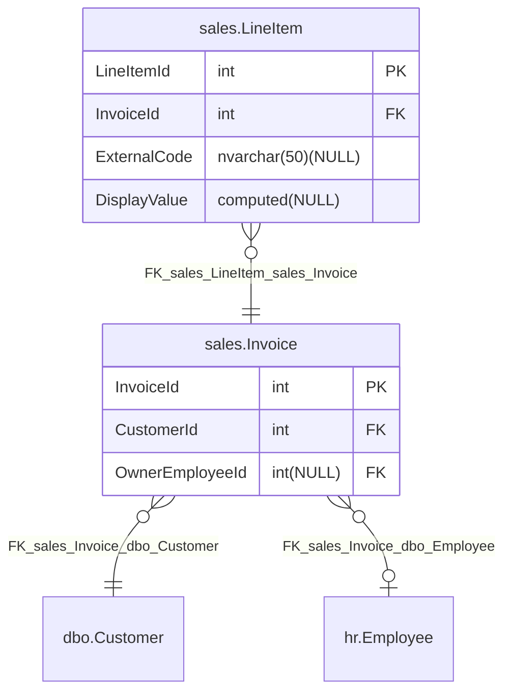

```mermaid
erDiagram
  "sales.Invoice" {
    InvoiceId int PK
    CustomerId int FK
    OwnerEmployeeId int(NULL) FK
  }
  "sales.Invoice" }o--|| "dbo.Customer" : FK_sales_Invoice_dbo_Customer
  "sales.Invoice" }o--o| "hr.Employee" : FK_sales_Invoice_dbo_Employee
  "sales.LineItem" {
    LineItemId int PK
    InvoiceId int FK
    ExternalCode nvarchar(50)(NULL) 
    DisplayValue computed(NULL) 
  }
  "sales.LineItem" }o--|| "sales.Invoice" : FK_sales_LineItem_sales_Invoice
  "dbo.Customer" {
  }
  "hr.Employee" {
  }
```
